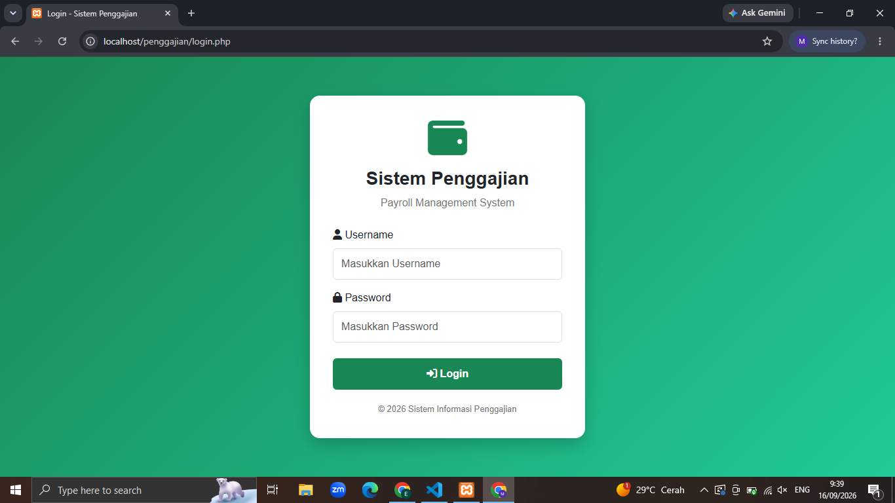

# Sistem Informasi Penggajian Berbasis Web

Sistem Informasi Penggajian Berbasis Web merupakan aplikasi yang dikembangkan untuk membantu proses pengelolaan data pegawai, jabatan, absensi, penggajian, dan pelaporan secara terkomputerisasi.

Aplikasi ini dirancang untuk membantu mengurangi proses pengolahan data secara manual, meminimalkan kesalahan dalam perhitungan penggajian, serta mempermudah penyajian laporan kepada pimpinan.

## Fitur Utama

### Admin

Admin memiliki akses untuk mengelola data dan proses utama dalam sistem.

* Login dan autentikasi pengguna
* Dashboard
* Kelola data jabatan
* Kelola data pegawai
* Kelola data absensi
* Kelola data penggajian
* Perhitungan dan pengelolaan gaji
* Pengelolaan potongan gaji
* Melihat laporan
* Mencetak laporan dalam format PDF
* Logout

### Pimpinan

Pimpinan memiliki akses untuk melihat informasi dan laporan yang telah dikelola oleh admin.

* Login dan autentikasi pengguna
* Dashboard
* Melihat data pegawai
* Melihat data absensi
* Melihat data penggajian
* Melihat laporan
* Mencetak laporan dalam format PDF
* Logout

## Teknologi yang Digunakan

| Teknologi       | Keterangan                    |
| --------------- | ----------------------------- |
| PHP             | Bahasa pemrograman utama      |
| MySQL / MariaDB | Database                      |
| HTML5           | Struktur halaman web          |
| CSS3            | Styling dan tampilan          |
| JavaScript      | Interaksi pada halaman        |
| Bootstrap       | Framework antarmuka           |
| FPDF            | Pembuatan laporan PDF         |
| XAMPP           | Local development environment |
| Git             | Version control               |
| GitHub          | Repository dan portfolio      |

## Struktur Sistem

```text
sistem-informasi-penggajian-web/
│
├── admin/
│   ├── absensi/
│   ├── jabatan/
│   ├── laporan/
│   ├── pegawai/
│   ├── penggajian/
│   └── dashboard.php
│
├── pimpinan/
│   ├── laporan/
│   ├── absensi.php
│   ├── pegawai.php
│   ├── penggajian.php
│   └── dashboard.php
│
├── config/
│   └── koneksi.php
│
├── template/
│   ├── header.php
│   ├── navbar.php
│   ├── sidebar.php
│   ├── sidebar_pimpinan.php
│   └── footer.php
│
├── assets/
│   └── css/
│
├── fpdf.php
├── login.php
├── proses_login.php
├── logout.php
└── README.md
```

## Alur Penggunaan

### Admin

```text
Login
  ↓
Dashboard
  ↓
Kelola Jabatan
  ↓
Kelola Pegawai
  ↓
Kelola Absensi
  ↓
Kelola Penggajian
  ↓
Laporan
  ↓
Cetak Laporan
```

### Pimpinan

```text
Login
  ↓
Dashboard
  ↓
Melihat Informasi
  ↓
Melihat Laporan
  ↓
Cetak Laporan
```

## Perhitungan Penggajian

Sistem menggunakan komponen penggajian yang terdiri dari:

```text
Total Gaji = Gaji Pokok + Tunjangan + Bonus - Potongan
```

Potongan dapat digunakan untuk mencatat pengurangan gaji seperti kasbon atau kebutuhan administrasi lainnya.

## Database

Nama database yang digunakan:

```text
db_penggajian
```

Database dapat dibuat melalui **phpMyAdmin** dan dikonfigurasi pada:

```text
config/koneksi.php
```

> File SQL database tersedia di repository pada folder `database/` agar project dapat lebih mudah digunakan kembali oleh pengguna lain.


## Instalasi dan Menjalankan Project

### 1. Install XAMPP

Pastikan XAMPP sudah terpasang dan Apache serta MySQL/MariaDB dapat dijalankan.

### 2. Clone Repository

Clone repository ini ke dalam folder `htdocs`:

```bash
git clone https://github.com/mfazrisugara/sistem-informasi-penggajian-web.git
```

Atau download repository sebagai ZIP dan ekstrak ke:

```text
C:\xampp\htdocs\
```

### 3. Buat Database

Buka:

```text
http://localhost/phpmyadmin
```

Kemudian buat database:

```text
db_penggajian
```

Import file SQL database ke database tersebut.

### 4. Konfigurasi Database

Periksa konfigurasi pada:

```text
config/koneksi.php
```

Konfigurasi default untuk lingkungan lokal:

```php
$host = "localhost";
$user = "root";
$pass = "";
$db   = "db_penggajian";
```

### 5. Jalankan Aplikasi

Setelah Apache dan MySQL/MariaDB aktif, buka:

```text
http://localhost/penggajian/
```

## Tampilan Aplikasi

### Halaman Login


## Hak Akses Pengguna

| Role     | Akses                                |
| -------- | ------------------------------------ |
| Admin    | Mengelola data dan proses penggajian |
| Pimpinan | Melihat informasi dan laporan        |

## Tujuan Pengembangan

Project ini dikembangkan sebagai implementasi pengembangan aplikasi berbasis web dengan menerapkan konsep:

* CRUD (Create, Read, Update, Delete)
* Autentikasi pengguna
* Role-based access
* Relasi database
* Pengolahan data penggajian
* Pembuatan laporan
* Export laporan ke PDF
* Pengembangan aplikasi menggunakan PHP dan MySQL/MariaDB
* Version control menggunakan Git dan GitHub

## Pengembangan Selanjutnya

Beberapa pengembangan yang dapat dilakukan pada versi berikutnya:

* Penggunaan password hashing yang lebih aman
* Validasi input yang lebih ketat
* Penggunaan prepared statements untuk meningkatkan keamanan query
* Peningkatan responsivitas antarmuka
* Penambahan filter dan pencarian laporan
* Penambahan grafik statistik pada dashboard
* Penambahan sistem notifikasi
* Deployment ke server agar dapat diakses secara online

## Status Project

**Status:** Completed — Portfolio Version

Project ini merupakan aplikasi yang dikembangkan untuk pembelajaran dan portfolio pengembangan perangkat lunak berbasis web.

## Developer

**M FAZRI SUGARA**

Program Studi Informatika

---
